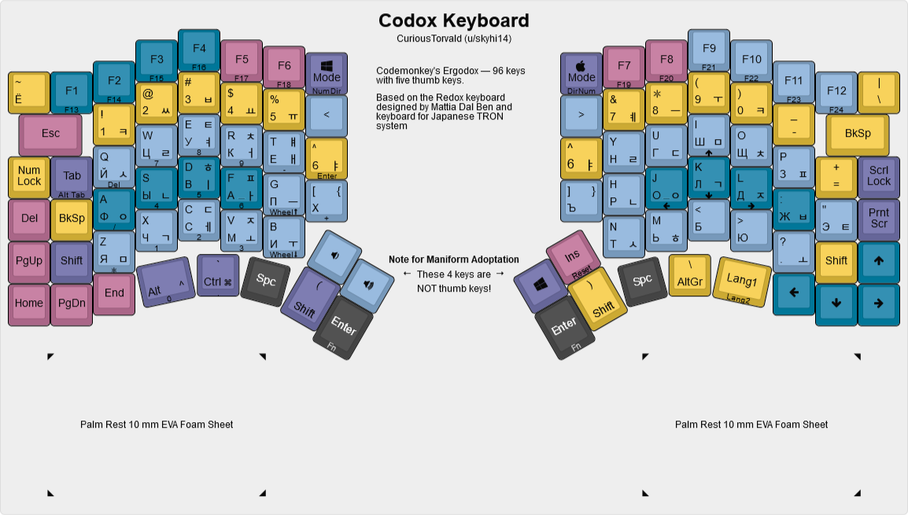

# Codox Keyboard and Codox Reduced Layout

Codemonkey's Ergodox — 96 keys with five thumb keys for each hand.

## Codox Keyboard

[Permalink](http://www.keyboard-layout-editor.com/#/gists/ad6df7f1135bbb0abf67581d130b4177)

Codox keyboard is a layout for programmer's split ergonomic keyboard with 96 keys. This layout is an improvement and expansion over the Ergodox keyboard, the layout itself is based on the [Redox Keyboard](https://github.com/mattdibi/redox-keyboard) and a [keyboard for the Japanese TRON system](http://xahlee.info/kbd/TRON_keyboard.html).

Codox keyboard is a suggestion to address these issues the existing split ergonomic keyboards (namely Ergodox) when used for writing code:

* Shift workloads to thumbs — the strongest digits are being wasted to just hit a long bar
* Thumb key arrangement (NOT clusters!) better than Ergodox — one of the main criticism over the Ergodox
* Keep arrows and F1–F12 keys on the main layer
* Keep letters at their position — no more awkward (or nonexistent) keys for non-English typists
* Thumb parentheses and dedicated bracket keys.
* More aggressive columnar staggering — a definitive improvement over Ergodox
* Layout suitable for both planar (2D) and maniform (3D) builds

### Note for builders

See [codox_build_readfirst.md](codox_build_readfirst.md)

# Codox Reduced

TODO: screenshot from the QMK configurator

Codox Reduced is a keyboard layout for the [Redox Keyboard](https://github.com/mattdibi/redox-keyboard), which maintains as much of the functionality of the full Codox and a something that you can actually use; in fact I'm using it right now.
